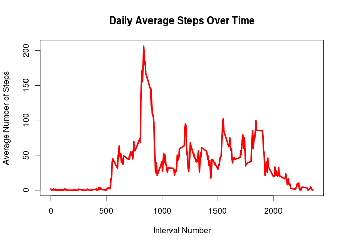
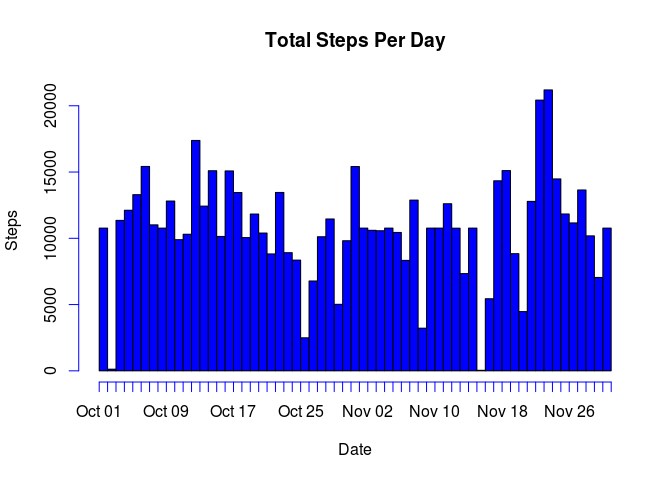

# Reproducible Research: Peer Assessment 1


## Loading and preprocessing the data

The raw data set from the file "activity.csv" is loaded into the variable
"activity".  The column heads in the file are used as the header.


```r
activity = read.csv(file = "activity.csv",header=TRUE)
```

The column headings in the data frame are then:


```r
names(activity)
```

```
## [1] "steps"    "date"     "interval"
```

When loaded, the "steps" and "interval" columns already have "integer" format,
but the "date" column must be converted to the "Date" format.  We also add an
additional column indicating the time of day, derived from the "interval"
column.  Note that leading zeros are requires to convert the interval to a time
in the %H%M format.


```r
activity$date = as.Date(as.character(activity$date), format = "%Y-%m-%d")
activity$time = strptime(paste(format(activity$date, "%Y-%m-%d"), sprintf("%04d",activity$interval),sep=" "), format = "%Y-%m-%d %H%M")
```

## What is mean total number of steps taken per day?

We need to break up the data frame by day and count the totals.  The intervals
are not used here, so they are discarded.

This step requires the dplyr package.


```r
library(dplyr)
```

```
## 
## Attaching package: 'dplyr'
## 
## The following object is masked from 'package:stats':
## 
##     filter
## 
## The following objects are masked from 'package:base':
## 
##     intersect, setdiff, setequal, union
```

```r
activity_summary = activity[complete.cases(activity$steps),c("date","steps")] %>% group_by(date) %>% summarise_each(funs(sum))
```

The standard histogram method in R does not take in weights, the the weighted
histogram methods available in other libraries I found do not accept "date"
objects for binning.  This can be worked around (in this case) by creating a
repeating list wherein each value is repeated a number of times equal to
"steps".

The entire sequence of dates must be input into the histogram function to
prevent the two lowest bins fro being summed and including the empty days on
either side of the data set along with those in the middle.


```r
hist(rep(activity_summary$date,activity_summary$steps),breaks =seq(as.Date("2012-10-01","%Y-%m-%d"),as.Date("2012-12-01","%Y-%m-%d"),by="days"),freq=TRUE,right=FALSE,include.lowest=FALSE,col="blue",xlab = "Date",ylab="Steps",main="Total Steps Per Day")
```

 

Finally, we want the mean and median number of steps taken each day.  We have
already removed the unrecorded days from "activity_summary", so these for the
days for which there is active data these values are,


```r
mean(activity_summary$steps)
```

```
## [1] 10766.19
```

```r
median(activity_summary$steps)
```

```
## [1] 10765
```

## What is the average daily activity pattern?

To take a daily average, we group by the individual five-minutes intervals 
rather than dates, taking the mean rather than total of the number of steps.

Once again the "dplyr" package is required.


```r
daily_average = activity[complete.cases(activity$steps),c("steps", "interval")] %>% group_by(interval) %>% summarise_each(funs(mean))
```

A column corresponding to the times of day is appended to the data frame.
Its corresponding date (Oct. 1, 2012) is superfluous, but the hour/minute
data can still be used.


```r
daily_average$time = activity$time[activity$date == as.Date("2012-10-01")]
```

The time series of the average number of steps is then (the time series uses
24-hour notation),


```r
plot(steps ~ interval, daily_average, type = "l",col="red",lwd=3,main="Daily Average Steps Over Time",xlab = "Interval Number",ylab = "Average Number of Steps")
```

 

```r
plot(daily_average$time, daily_average$steps, type = "l",col="red",lwd=3,main="Daily Average Steps Over Time",xlab = "Interval Number",ylab= "Average Number of Steps")
```

 

And the interval with the maximum number of steps is


```r
format(daily_average$time[daily_average$steps == max(daily_average$steps)], "%H:%M")
```

```
## [1] "08:35"
```

## Imputing missing values

The number rows where the number of steps taken is missing are given by


```r
nrow(activity[is.na(activity$steps),])
```

```
## [1] 2304
```

The missing values are primarily found for entire days.  If extrapolation for
the missing values is necessary, the most reasonable extrapolation is therefore
the daily average of individual intervals.

A dates vector is created containing all the dates in the data frame, then a
for loop replaced NA values for each day with the corresponding values in the
daily average steps data set.  The new data set is titled
"extrapolated_activity".


```r
extrapolated_activity = activity
dates = levels(factor(activity$date))
for(d in dates) {
    na_values = is.na(activity$steps[activity$date == d])
    extrapolated_activity$steps[activity$date == d][na_values] = daily_average$steps[na_values]
}
```

The same steps as before are applied to the extrapolated data set, producing the histogram


```r
extrapolated_activity_summary = extrapolated_activity[complete.cases(extrapolated_activity$steps),c("date","steps")] %>% group_by(date) %>% summarise_each(funs(sum))
hist(rep(extrapolated_activity_summary$date,extrapolated_activity_summary$steps),breaks =seq(as.Date("2012-10-01","%Y-%m-%d"),as.Date("2012-12-01","%Y-%m-%d"),by="days"),freq=TRUE,right=FALSE,include.lowest=FALSE,col="blue",xlab = "Date",ylab="Steps",main="Total Steps Per Day")
```

 

And the corresponding mean and median


```r
mean(extrapolated_activity_summary$steps)
```

```
## [1] 10766.19
```

```r
median(extrapolated_activity_summary$steps)
```

```
## [1] 10766.19
```

The mean is unsurprisingly identical to the previous mean, while the media is
increased only slightly.  The overall estimate of total daily steps is
unchanged because the extrapolation scheme was designed to make that value
invariant.

## Are there differences in activity patterns between weekdays and weekends?

Here we once again remove days with missing date values, since they represent
an average of weekday and weekend activity and thus an extrapolation would lead
to skewed results.

A factor variable named "day_type" is added to the "activity" data frame with


```r
activity$day_type = ifelse(weekdays(activity$date) == "Sunday" | weekdays(activity$date) == "Saturday","weekend","weekday")
```

Grouping can be accomplished in the same manner as above, but splitting up the
data set by day type as well according to the "day_type" variable.  The
grouping by "day_type"" then "interval" is crucial for the ordering of the
"time" concatenation to be correct.


```r
weekday_daily_average = activity[complete.cases(activity$steps) & activity$day_type == "weekday" ,c("steps", "interval")] %>% group_by(interval) %>% summarise_each(funs(mean))
weekday_daily_average$time = activity$time[activity$date == as.Date("2012-10-01")]
weekend_daily_average = activity[complete.cases(activity$steps) & activity$day_type == "weekend",c("steps", "interval")] %>% group_by(interval) %>% summarise_each(funs(mean))
weekend_daily_average$time = activity$time[activity$date == as.Date("2012-10-01")]
```

A panel plot of the two data sets looks like


```r
par(mfrow=c(2,1))
plot(weekday_daily_average$time, weekday_daily_average$steps, type = "l",col="red",lwd=3,ylab="Average Steps",xlab = "Time",main= "Average Number of Steps -- Weekdays")
plot(weekend_daily_average$time, weekend_daily_average$steps, type = "l",col="blue",lwd=3,ylab="Average Steps",xlab = "Time",main= "Average Number of Steps -- Weekends")
```

 

For a better comparison, a similar plot can be made with two line colors and a
legend.


```r
plot(weekday_daily_average$time, weekday_daily_average$steps, type = "l",col="red",lwd=3,main="Daily Average Steps Over Time For Weekdays and weekends",xlab = "Time",ylab= "Average Number of Steps")
lines(weekend_daily_average$time, weekend_daily_average$steps,col="blue",lwd=3)
legend("topright",legend=c("Weekdays","Weekends"),col=c("red","blue"),lty=1,lwd=3)
```

 
